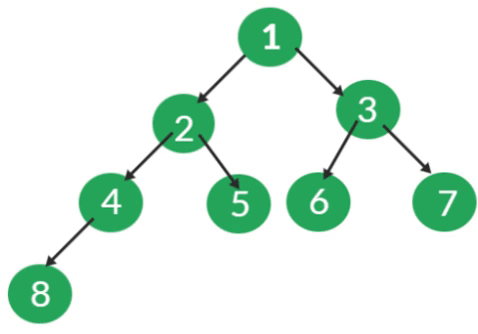

# Heap

### What we are trying to Solve?  Handling priority <a href="#heading_id_5" id="heading_id_5"></a>

* Problem Description: given a collection of tasks with different priorities, determine which task should be executed next.
* Whenever resources (for example, CPU usage) are limited, there comes the need to prioritise.
* Applications include: graph algorithms like Dijkstra's, scheduling algorithms, and sorting.


### What’s a heap?

* A heap is a tree-like data structure where each node must be ordered with respect to the value of its children.&#x20;
* There are two types of heap: **maxHeap** and **minHeap**. In a **maxHeap**, parent node values are greater than those of their children, whereas the opposite is true in a **minHeap**.


### Why Study Heap ?

A heap is a useful and efficient way to store and look up data that must maintain order. An practical implementation of heap in the real world is priority queue.

Priority queue is a set of data where higher or lower valued data points to the front of the queue and are therefore accessed first.


### Binary Heap

Priority queues are frequently implemented as binary heap.

* enqueue and extract-min/max run in time `O(log n)`.
* `findMin()`/`findMax()` runs in time `O(1)`.
* :information\_source: Awesome video from WILLIAN FISET explaining Priority Queue/Heaps :link:[Priority Queue Intro](https://www.youtube.com/watch?app=desktop\&v=wptevk0bshY).
* The heapify operation efficiently converts an array into a heap in `O(n)` time.


* Binary heaps are a type of binary tree commonly used to implement heaps.&#x20;
* **The structure of a binary heap** ensures **completeness** and **shape**.&#x20;
  * Completeness means all levels of the tree are filled except the last level, which is filled from left to right.&#x20;
  * Shape refers to the binary tree being a full binary tree, with the last level having the fewest nodes.
* **The heap order property** determines the **arrangement** of **elements** within the binary heap. In a **maxHeap**, the key of a node is greater than or equal to the keys of its descendants. In a **minHeap**, the key of a node is less than or equal to the keys of its descendants.
* To maintain the proper functioning of insertion and deletion operations, it is crucial to preserve the heap ordering property.&#x20;
  * New elements added to the heap should either "bubble up" (percolate upwards) or "bubble down" (percolate downwards) to maintain the heap invariant.


#### Stacks & Queues vs. Priority Queue

> Whereas both stacks and queues 4 depended solely on the order in which data was inserted, priority queues use an additional piece of information to determine the retrieval order.
>
> \- KUBICA, 2022


#### Adding a new Element in a minHeap

1. Begin by placing the key in the first available spot from the left on the heap’s last level.&#x20;
   * If the last level is fully occupied, position the key as the leftmost element on the subsequent level (This action maintains the property of a complete binary tree).
2. Now it is necessary verify if the **minHeap** property is still intact.
   1. If the parent of the inserted key is less than the key, the **minHeap** property remains unviolated.&#x20;
   2. Else, the parent’s value is greater than the inserted key, swap their positions.
      * :information\_source: This action might disrupt the heap property at the parent node, so continue this process until the heap property is restored.

* The time complexity of inserting an element is O(logN).&#x20;
* The following illustrates how -1 is inserted into a Binary heap by adhering to the steps outlined above.

<figure><figcaption><p>Font: ANGAJALA<em>, 2022</em></p></figcaption></figure>


### Binary Heap - Implementation


#### Iterative Approach

1. Append the new node at the end of the array.
2. Initialize index to the new item's index
3. Loop while index is not at the root:
   1. Calculate the parent's index
   2. Swap if the parent has the greater key.
   3. Set index to the parent's index
4. Exit loop once heap property is satisfied.

```java
public void insertMinHeap(int[] arr, int value) {
    int n = arr.length;
    arr[n] = value;
    int index = n;
    
    while (index > 0 && value < arr[(index - 1) / 2]) {
        arr[index] = arr[(index - 1) / 2];
        index = (index - 1) / 2;
    }
    
    arr[index] = value;
}
```

```java
import java.util.Arrays;

public class Solution {
    private int[] arr;
    private int size;

    public Solution() {
        arr = new int[10]; // Initial capacity, can be adjusted as needed
        size = 0;
    }

    public void insertMinHeap(int value) {
        /**
         * Insert a new element into the min heap.
         *
         * @param value (int): The value to be inserted into the min heap.
         */
        int n = size;
        if (size >= arr.length) {
            // Double the size of the array if it's full
            arr = Arrays.copyOf(arr, arr.length * 2);
        }
        arr[n] = value;
        size++;

        int key = n;
        while (key > 0 && value < arr[(key - 1) / 2]) {
            arr[key] = arr[(key - 1) / 2];
            key = (key - 1) / 2;
        }

        arr[key] = value;
    }

  	//Print the min heap.
    public void printMinHeap() {
        System.out.print("Min Heap: ");
        for (int index = 0; index < size; index++) {
            System.out.print(arr[index] + " ");
        }
        System.out.println();
    }

    public static void main(String[] args) {
        Solution minHeap = new Solution();

        // Test case 1
        minHeap.insertMinHeap(5);
        minHeap.printMinHeap();

        // Test case 2
        minHeap.insertMinHeap(2);
        minHeap.printMinHeap();

        // Test case 3
        minHeap.insertMinHeap(8);
        minHeap.printMinHeap();
    }
}

```


#### Iterative Approach

1. Append new item to end of heap array
2. Call recursive helper to heapify up:
   1. If index 0, return (base case)
   2. Get parent index
   3. If parent > item, swap them
   4. Call heapifyUp recursively on the parent index.

````java
import java.util.Arrays;

public class Solution {
    public static void printMinHeap(int[] arr, int size) {
        // Function to print the min heap
        System.out.print("Min Heap: ");
        for (int index = 0; index < size; index++) {
            System.out.print(arr[index] + " ");
        }
        System.out.println();
    }

    public static void heapify(int[] arr, int size, int index) {
        // Function to heapify the min heap from the given index
        int smallestValue = index;
        int leftChild = 2 * index + 1;
        int rightChild = 2 * index + 2;

        if (leftChild < size && arr[leftChild] < arr[smallestValue]) {
            smallestValue = leftChild;
        }

        if (rightChild < size && arr[rightChild] < arr[smallestValue]) {
            smallestValue = rightChild;
        }

        if (smallestValue != index) {
            int temp = arr[index];
            arr[index] = arr[smallestValue];
            arr[smallestValue] = temp;
            heapify(arr, size, smallestValue);
        }
    }

    public static void insertMinHeap(int[] arr, int value, int size) {
        arr[size] = value;
        size++;

        for (int index = size / 2 - 1; index >= 0; index--) {
            heapify(arr, size, index);
        }
    }

    public static void main(String[] args) {
        int[] minHeap = new int[100]; // Assuming max heap size is 100
        int size = 0; // Current size of the heap

        // Test case 1
        insertMinHeap(minHeap, 5, size++);
        printMinHeap(minHeap, size);

        // Test case 2
        insertMinHeap(minHeap, 2, size++);
        printMinHeap(minHeap, size);

        // Test case 3
        insertMinHeap(minHeap, 8, size++);
        printMinHeap(minHeap, size);
    }
}
```
````


### Array Time Complexity Operations Summary

<figure><figcaption><p>Font: Design Gurus, 2023a</p></figcaption></figure>


### Heap Important Features

**Definition:** We define the “height” of a node in a heap to be the number of edges on the longest simple downward path from the node to a leaf. **The height of a heap is the height of its root**.

**Fact:** A heap of `n` nodes has a height of  logn c. (Why? Hint: if a heap has height h, what are the minimum and maximum possible number of elements in it? Answer: 2h ≤ n ≤ 2 h+1 − 1)

Definition: The “max-heap property” (of a heap A) is the property we were talking about, where for every node i other than the root, A\[parent\[i]] ≥ A\[i]. The “min-heap property” is defined analogously.

* Its left child has index 2i
* Its right child has index 2i + 1
* Its parent has index bi/2c
* the number of non-leaves nodes are `|_n/2_|`
* The leaves of the heap are the nodes indexed by `|_n/2_|` + 1, . . . , n.


### References

KUBICA, Jeremy. Data Structures the Fun Way_._ 2nd ed_._ San Francisco: No Starch Press, 2022.


ANGAJALA, SaiSri. Insert in Binary Heap. takeUforward, 2022. Disponível em: <[https://takeuforward.org/heap/insert-in-binary-heap/](https://takeuforward.org/heap/insert-in-binary-heap/)>. Acesso em: 6 jan. 2024.


Design Gurus. Grokking Data Structures for Coding Interviews: Introduction to Heap. Design Gurus, 2023. Disponível em: <[https://www.designgurus.io/course-play/grokking-data-structures-for-coding-interviews/doc/650eb465d8da406a4d935d33](https://www.designgurus.io/course-play/grokking-data-structures-for-coding-interviews/doc/650eb465d8da406a4d935d33)>. Acesso em: 6 jan. 2024a.
