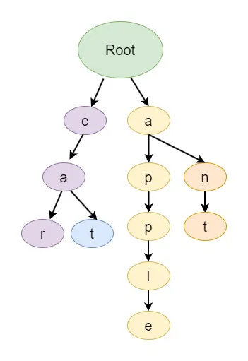

# Graph Representations

Graph can be represented in two ways:

1. Adjacency matrix.
2. Adjacency list.


### Adjacency Matrix

It is a square matrix where the rows and columns represent the nodes of the graph, and the entries (elements) of the matrix indicate whether there is an edge between the corresponding nodes.


#### Adjacency Matrix for Undirected Graphs <a href="#adjacency-matrix-for-undirected-graphs" id="adjacency-matrix-for-undirected-graphs"></a>

For an undirected edge between nodes i and j, the corresponding entries in the matrix (A\[i]\[j] and A\[j]\[i]) will have a value of 1, indicating the presence of an edge. If there is no edge between nodes i and j, the matrix entries will have the value of 0.


<figure><figcaption><p>Font:  Design Guru, 2023a</p></figcaption></figure>


#### Adjacency Matrix for Directed Graphs <a href="#adjacency-matrix-for-undirected-graphs" id="adjacency-matrix-for-undirected-graphs"></a>

<figure><figcaption><p>Font:  Design Guru, 2023a</p></figcaption></figure>


### Adjacency list

In linked list representation, an adjacency list is used to store the graph. In an adjacency list, each nodes is associated with a list of its neighbouring nodes directly connected to it.


#### Representing Undirected Graphs Using Adjacency List <a href="#representing-directed-graphs-using-adjacency-list" id="representing-directed-graphs-using-adjacency-list"></a>

<figure><figcaption><p>Font:  Design Guru, 2023a</p></figcaption></figure>


#### Representing Directed Graphs Using Adjacency List <a href="#representing-directed-graphs-using-adjacency-list" id="representing-directed-graphs-using-adjacency-list"></a>

<figure><figcaption><p>Font:  Design Guru, 2023a</p></figcaption></figure>


**Java code Example Directed Graphs Using Adjacency List:**

```java
// ArrayList of linked lists of integers:
ArrayList<LinkedList<Integer>> adj_list;

// HashMap of linked lists of integers:
HashMap<Integer, ArrayList<Integer>> adjacencyList;


// Initialisation code
// ...

// A->B, A->C, C->D, D->B
// (0 -> 1), (0 -> 2), (2 -> 3), (3 -> 1)
adj_list.get(0).add(1);
adj_list.get(0).add(2);
adj_list.get(2).add(3);
adj_list.get(3).add(1)
```


### References

Design Gurus. Grokking Data Structures for Coding Interviews: Introduction to Graph. Design Gurus, 2023. Disponível em: <[https://www.designgurus.io/course-play/grokking-data-structures-for-coding-interviews/doc/650eb465d8da406a4d935d33](https://www.designgurus.io/course-play/grokking-data-structures-for-coding-interviews/doc/650eb465d8da406a4d935d33)>. Acesso em: 6 jan. 2024a.
