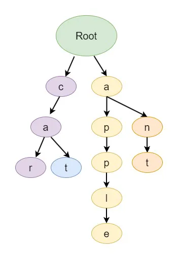

# Tree

In the realms of computer science and data structures, trees are constituted by nodes that are interconnected by edges. The common usage of these structures is found in the representation of data and its hierarchical organization.

> A tree is made up of **nodes** that are arranged in a hierarchical structure. At the top of the hierarchy is the **root** node, which acts as the **starting point**. All other **nodes are connected** through **edges**. The **nodes are grouped into levels**, and the **maximum level** of any node in the tree is referred to as the **depth**.
>
> \
> \- Design Gurus, 2023a.

### Fundamentals Concepts

* Root Node: This is the uppermost node in the tree, serving as the origin point for the entire tree. It is also the starting point for any tree traversal operation.
* Nodes: These are the individual elements that make up the tree, including the root. Each node has a unique value and may be connected to child nodes.
*   Parent Node: This is a node that has one or more nodes, known as child nodes, linked to it.

    Child Node: These are nodes that have a direct connection to a parent node.
* Sibling Nodes: These are nodes that have the same parent node.
* Ancestor Nodes: These are all the nodes that lie along the path from a given node up to the root node.
* Descendant Nodes: These are all the nodes that can be reached from a specific node, extending down to the leaf nodes.
* Leaf Node: These are the nodes in the tree that do not have any child nodes.
* Subtree: This is a smaller tree that exists within the main tree, composed of a node and all its descendant nodes.
* Tree Height: The height of a tree is the number of edges on the longest path from the root node to the leaf node (It represents the **depth** of the tree from the **root**).
* Node Depth: the depth of a specific node in the tree is the number of edges **from the root node to that particular node**.
* Levels in Trees: Levels in a tree are defined based on the distance from the root node. The root node is at level 0; its children are at level 1, and so on.

<figure><figcaption>
Font: Design Gurus, 2023a
</figcaption></figure>

### Types of Tress

#### Binary Trees

* Binary trees are a type of tree where each node can have at most two children.

#### Full Trees

* In a full tree, every node has either zero children (leaf node) or two children.
* Also known as **proper binary trees**.

#### Complete Tree

* A complete tree is a binary tree in which all levels are filled, except possibly the last level. The last level must strictly be filled from left to right.
*   **Properties:**

    * The number of nodes at depth **d** is $$2^d$$ .
    * The height of a complete tree is  $$log(n+1)$$ (where, `n` is the number of nodes).

#### Balanced Tree 

* Balanced trees are binary trees where the difference in height between the left and right subtrees of any node in the tree is not more than 1.

<figure><figcaption>
Font: Geeks For Geeks, [s.d.]
</figcaption></figure>

#### Multi-way Trees

Unlike binary trees, multi-way trees allow nodes to have more than two children.

### Binary Search Tree (BST)

[binary-search-tree-bts.md](binary-search-tree-bts.md "mention")

### References 

Design Gurus. Grokking Data Structures for Coding Interviews: Introduction to Queue. Design Gurus, 2023. Disponível em: <[https://www.designgurus.io/course-play/grokking-data-structures-for-coding-interviews/doc/6491e0d6cc1ee5e292d494c7](https://www.designgurus.io/course-play/grokking-data-structures-for-coding-interviews/doc/6491e0d6cc1ee5e292d494c7)>. Acesso em: 11 dez. 2023a.

Geeks For Geeks. Types of Binary Tree. Geeks For Geeks, \[s.d.]. Disponível em: <[https://www.geeksforgeeks.org/types-of-binary-tree](https://www.geeksforgeeks.org/types-of-binary-tree)>. Acesso em: 11 dez. 2023a.

