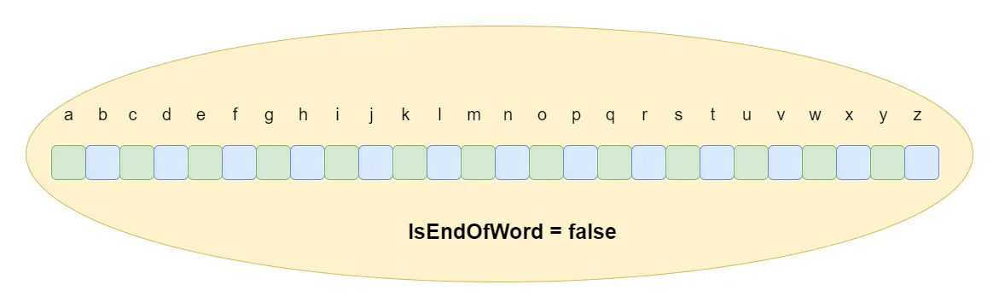

# Trie Representations

* A Trie node encompasses an array or list, which serves as the children nodes.
* The size of this array or list is typically 26, a representation of the English lowercase alphabets (a-z).
* An additional feature of the Trie node is a boolean flag, termed as `isEndOfWord`.
* This flag serves to indicate whether the current node signifies the termination of a word in the Trie.

<figure><figcaption><p>Font: Design Gurus, 2023</p></figcaption></figure>

```java
class TrieNode {
    TrieNode[] children = new TrieNode[26]; // Children nodes
    
    boolean isEndOfWord; // Flag to represent the end of a word

    String letter;

    public TrieNode(String letter) {
        isEndOfWord = false;
        
        for (int i = 0; i < 26; i++)
            children[i] = null;

        this.letter = letter;
    }
}
```


```java
public class TrieNodeHash {
    public Map<Character, TrieNodeHash> children;
    public boolean isEndOfWord; // Flag to represent the end of a word

    public TrieNodeHash() {
        this.isEndOfWord = false;
        this.children = new TreeMap<>();
    }
}
```


### References

Design Gurus. Grokking Data Structures for Coding Interviews: Introduction to Trie. Design Gurus, 2023. Disponível em: <[https://www.designgurus.io/course-play/grokking-data-structures-for-coding-interviews/doc/650eb465d8da406a4d935d33](https://www.designgurus.io/course-play/grokking-data-structures-for-coding-interviews/doc/650eb465d8da406a4d935d33)>. Acesso em: 21 jan. 2024.
